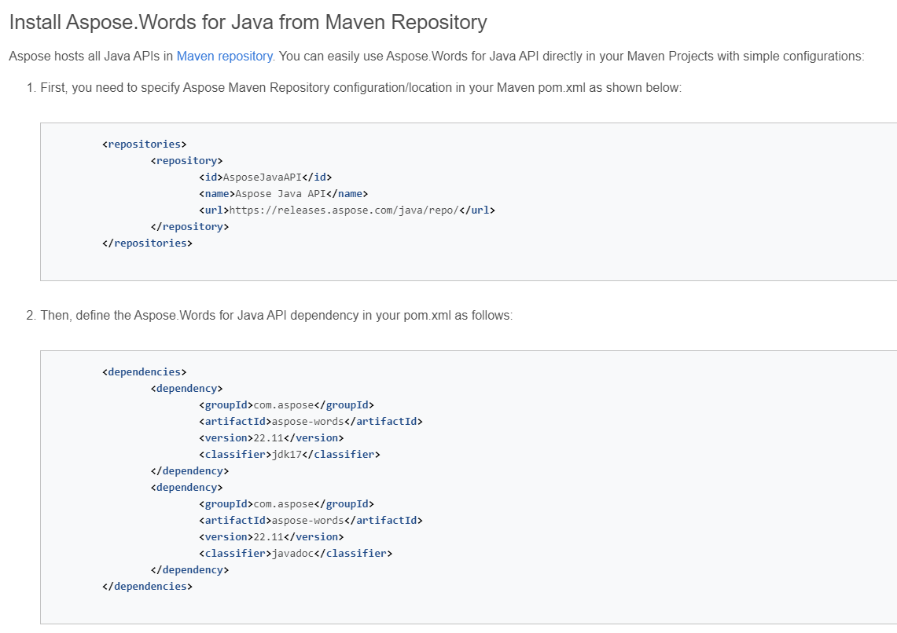
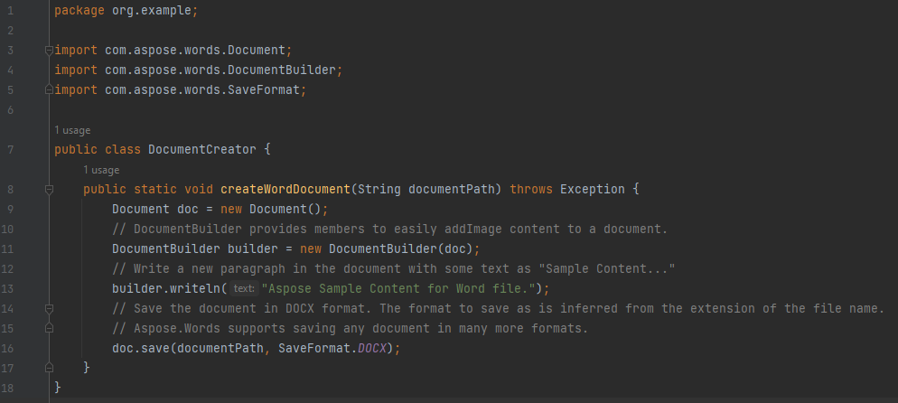
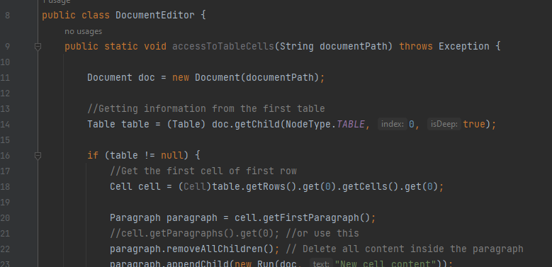
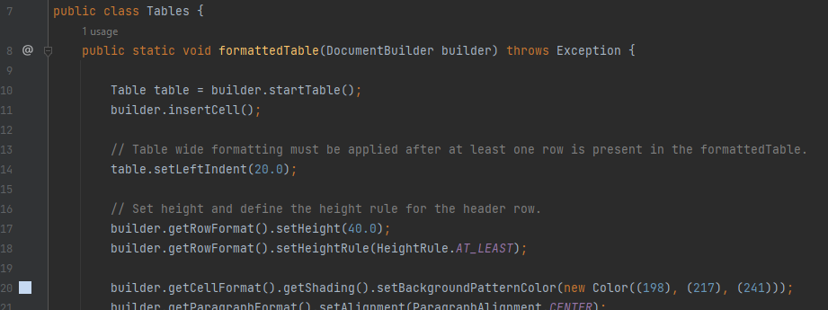
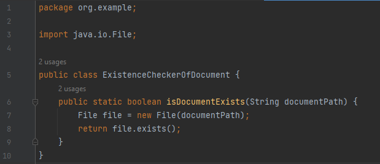
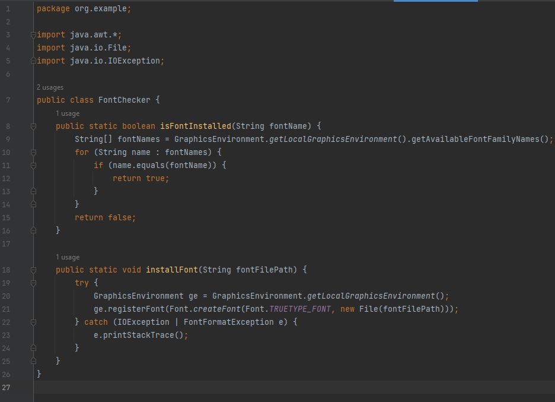

# Aspose.Word Library

## Introduction
Aspose.Words for Java is a class library designed to facilitate various document processing tasks. It supports a wide range of popular document formats including DOC, DOCX, RTF, HTML, Markdown, PDF, XPS, EPUB, and more. With Aspose.Words for Java, you can generate, modify, convert, render, and print documents without relying on third-party applications or Office Automation.

## Setup and Usage

### Document Creator Class

This class provides a method to create a new Word document:
- It utilizes the `Document` class constructor to initialize a new document object.
- It creates a `DocumentBuilder` object to facilitate content addition to the document.
- The `DocumentBuilder`'s `writeln` method is used to add sample content to the document.
- Finally, the `save` method of the `Document` class is called to save the document in the DOCX format at the specified path.

### Document Editor Class

The `DocumentEditor` class offers methods for editing Word documents such as:
1. `accessToTableCells(String documentPath)`: Allows access to the cells of a table in the specified Word document. It retrieves the selected cell of the selected row and applies the desired changes.
2. `addTableToDocument(String documentPath)`: Adds a table to the specified Word document utilizing methods from the `Tables` class.
3. `addImage(String documentPath)`: Inserts an image into the specified Word document by providing the path to the desired image.

### Tables Class

The `Tables` class provides methods to generate various types of tables in Word documents, offering flexibility in creating tables with different formats and styles.

### Existence Checker Of Document Class

The `ExistenceCheckerOfDocument` class contains a static method `isDocumentExists(String documentPath)` that checks whether a document file exists at the specified path and returns a boolean value.

### Font Checker Class

The `FontChecker` class contains two static methods:
1. `isFontInstalled(String fontName)`: Checks if a font with the specified name is installed on the system and returns a boolean value.
2. `installFont(String fontFilePath)`: Installs a custom font from the specified file path into the system (TTF format) if it's not already installed.

## Challenges
- **Limited Free Features**: Aspose.Words imposes restrictions on free usage, including the insertion of a message stating "Created with an evaluation copy of Aspose.Words" in documents generated with the evaluation version.
- **Lack of Extensive Learning Resources**: There is a shortage of comprehensive tutorials and examples for Aspose.Words, necessitating users to primarily rely on official documentation.
- **Alternative Solution**: Apache POI is a popular open-source alternative to Aspose.Words, offering similar functionality for working with Microsoft Office documents in Java, along with extensive documentation and community support.

